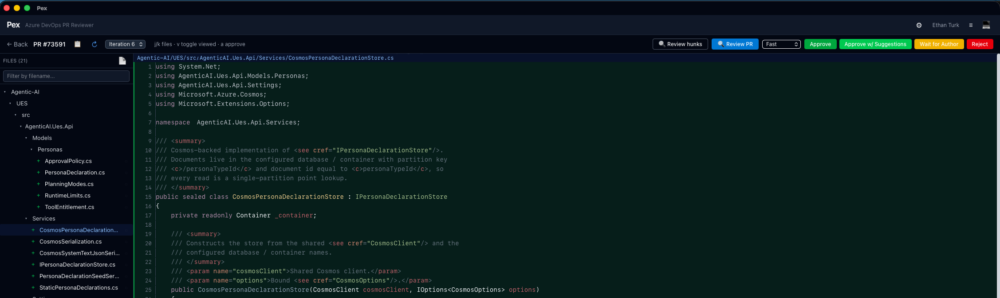

# Pex

**Pex is a fast, native desktop app for Azure DevOps pull request reviews.**

It gives you a focused PR list, a high-performance diff viewer, inline comments,
reviewer vote actions, file tracking, and optional AI-assisted PR review in one
Tauri desktop app.

<p align="center">
  
</p>

## Quick Start

Install Pex, connect it to Azure DevOps, then pick a project, repo, and PR.

### Install

**Linux / macOS**

```bash
curl -fsSL https://raw.githubusercontent.com/ethanturk/pex/master/install.sh | bash
```

**Windows PowerShell**

```powershell
iwr -useb https://raw.githubusercontent.com/ethanturk/pex/master/install.ps1 | iex
```

From a cloned repo:

```bash
./install.sh        # Linux / macOS
.\install.ps1       # Windows
```

To force a from-source install from a specific tag or branch, set `PEX_FROM_SOURCE`
and `PEX_REF` on the shell that runs the installer:

```bash
curl -fsSL https://raw.githubusercontent.com/ethanturk/pex/master/install.sh | PEX_FROM_SOURCE=1 PEX_REF=v0.4.1 bash
```

### First Run

1. Enter your Azure DevOps organization URL, for example `https://dev.azure.com/your-org`.
2. Sign in with either a Personal Access Token or browser OAuth.
3. Choose a project and repository.
4. Open a pull request and review files from the diff view.

Pex stores credentials in your OS keyring:

- macOS: Keychain
- Linux: Secret Service
- Windows: Credential Manager

## Common Workflows

### Review a Pull Request

- Use the PR list to filter by status and author.
- Open a PR to view files, changed lines, comments, and reviewer actions.
- Use `j` / `k` to move through files quickly.
- Press `v` to mark the current file viewed.
- Use the approval bar to approve, approve with suggestions, wait for author, or reject.

### Comment on Code

- Click a diff line to start or reply to an Azure DevOps comment thread.
- Existing threads are shown inline with the diff.
- File viewed state is synced per PR.

### Use AI Review

Pex can run an AI-assisted review across the PR and produce markdown findings.

1. Open AI settings from the top bar.
2. Choose a provider and enter the provider URL, API key, and model.
3. Click **Test** to verify the provider and model list.
4. Set review concurrency based on what your provider can handle.
5. Set the **confidence threshold** (default 80) to control how aggressively
   low-confidence findings are filtered out.
6. Start **Review PR** from the PR toolbar and choose **Fast** or **Thorough**.

Fast mode uses a single review pass per hunk. Thorough mode runs multiple
specialist passes (code review, silent-failure hunting, comment accuracy, test
coverage, type design, and simplification) and is slower, but can catch more
subtle issues.

Each hunk is reviewed with surrounding-file context to reduce false positives,
and every finding is scored 0–100 for confidence. An adjudication pass verifies
findings against the file before they surface; anything below the confidence
threshold, or anchored to a line outside the changed region, is dropped.

Findings are then triaged into tiers — **Blocking**, **Should fix**, **Nit**,
and **FYI** — and ordered blocking-first. Blocking and should-fix findings are
pulled forward (shown expanded, pre-selected for posting, and posted as
individual comments); nits and FYIs are pushed back (collapsed in the sidebar
and posted as a single rollup comment) so they never bury the important issues.
The **critical line** — how confident the reviewer must be before a critical
finding counts as blocking — is configurable in AI settings. Optionally, posting
a review that contains a blocking finding can also cast a "wait for author" vote.

Pex also learns from your review. Posting, editing, or **dismissing** a finding
is recorded; dismissed findings are **suppressed on the next review** of that PR
so the same noise doesn't come back. A **Calibration** tab in settings shows
accept rates by severity and tier, so you can tune the confidence threshold and
critical line with evidence. Enable **incremental review** to re-review only the
files changed since the last reviewed iteration.

For hands-off operation, opt into **automation** (all off by default):
**auto-review** runs a review automatically when a PR gets a new iteration, and
**auto-post** posts only the highest-confidence blocking findings (above a
confidence floor you set) while leaving everything else for you. For CI, the
headless `review_cli` example reviews a PR server-side and exits non-zero on
blocking findings so it can gate a pipeline.

## Features

- **Native desktop app** built with Tauri and Preact.
- **Azure DevOps PR list** with org, project, repo, status, and author selection.
- **Fast diff viewer** with side-by-side and inline diff modes.
- **Inline comments** for creating and replying to ADO comment threads.
- **Reviewer votes** for approve, approve with suggestions, wait for author, and reject.
- **File tracking** for viewed files and keyboard-driven review flow.
- **Iteration support** for reviewing changes across PR iterations.
- **Conflict highlighting** for inline `<<<<<<<` / `>>>>>>>` markers.
- **AI PR review** with resumable progress, markdown summaries, and postable findings.
- **Configurable AI providers** for OpenAI-compatible endpoints and Anthropic.
- **Dark and light themes** with system preference support.
- **Multi-org credentials** stored in the operating system keyring.

## Authentication

Pex supports two Azure DevOps auth paths.

### Personal Access Token

Create a PAT in Azure DevOps and grant at least:

- `Code (Read & Write)`

Paste the PAT into the first-run connection screen.

### OAuth

Browser OAuth requires a Microsoft Entra ID app registration.

1. Go to https://app.vsaex.visualstudio.com/app/register.
2. Register a new app with:
   - **Redirect URL:** `http://localhost:14820/callback`
   - **Scopes:** `Code (Read & Write)`, `Work Items (Read)`
3. Save the client ID to `~/.config/pex/client_id`.
4. Use **Sign in with browser (OAuth)** in Pex.

## Build From Source

Install prerequisites:

- Rust from https://rustup.rs
- Node.js 18 or newer from https://nodejs.org
- Linux only: WebKitGTK, GTK, Soup, and appindicator packages listed below

Then build:

```bash
npm install
npm run tauri build
```

Install the generated package:

```bash
# Linux
sudo dpkg -i src-tauri/target/release/bundle/deb/*.deb

# macOS
open src-tauri/target/release/bundle/dmg/*.dmg

# Windows
src-tauri/target/release/bundle/msi/*.msi
```

Run in development:

```bash
npm install
npm run tauri dev
```

### Linux System Dependencies

| Distro | Command |
|--------|---------|
| Fedora | `sudo dnf install webkit2gtk4.1-devel gtk4-devel libsoup3-devel libappindicator-gtk3-devel` |
| Ubuntu/Debian | `sudo apt install libwebkit2gtk-4.1-dev libgtk-4-dev libsoup-3.0-dev libappindicator3-dev` |
| Arch | `sudo pacman -S webkit2gtk-4.1 gtk4 libsoup3 libappindicator-gtk3 base-devel` |

## Keyboard Shortcuts

| Key | Action |
|-----|--------|
| `j` | Next file |
| `k` | Previous file |
| `v` | Toggle file viewed |
| `a` | Approve PR |

## Tech Stack

- **Rust**: Tauri v2, reqwest, similarity, syntect, rusqlite, keyring
- **Frontend**: Preact, TypeScript, Tailwind CSS v4, Signals
- **Packaging**: `.deb`, `.rpm`, `.AppImage`, `.dmg`, `.msi`
- **Updates**: `tauri-plugin-updater` with GitHub Releases

## Releases

Releases are built by GitHub Actions when a `v*` tag is pushed.

### One-Time Release Setup

Generate an updater signing key:

```bash
cargo tauri signer generate -w ~/.tauri/pex.key
```

Then:

1. Put the public key in `src-tauri/tauri.conf.json` under `plugins.updater.pubkey`.
2. Add the private key to GitHub Actions secrets as `TAURI_SIGNING_PRIVATE_KEY`.
3. If the private key has a password, add `TAURI_SIGNING_PRIVATE_KEY_PASSWORD`.

### Cut a Release

```bash
git tag v0.4.1
git push origin v0.4.1
```

The release workflow builds platform installers, signs updater artifacts, and
creates a draft GitHub Release.

## License

MIT. See [LICENSE](LICENSE).
